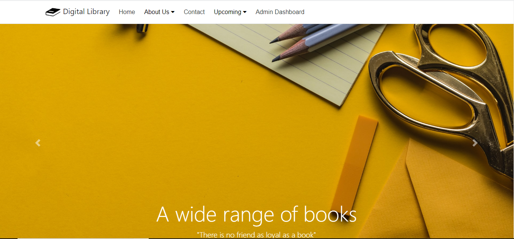
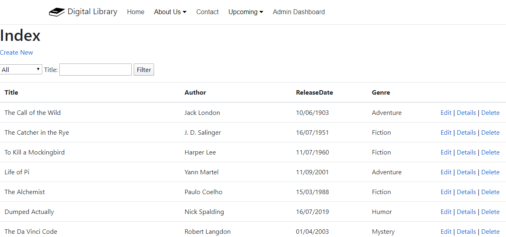
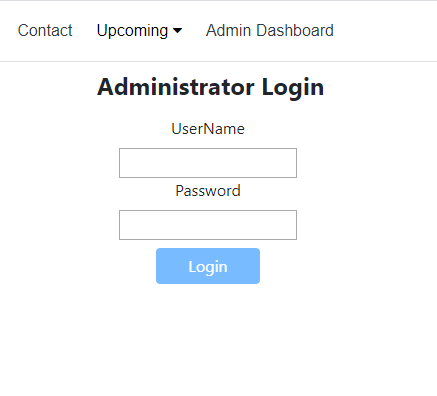

A Digital Library has been developed in this project where is simulated a real E Library environment where a user can enjoy reading his favourite books. Moreover the user can manage the books by editing their details, deleting the books or creating a new record book. A search feature is creating for the user to find more easily a book, either searching by genre or by the title of the book
The web application mainly consists on two parts, the book part and the member part, where the admin can manage user details after he successfully login into the system. 
Moreover the system consists on several view pages that can be accessed from the navigation bar, as the feature: Upcoming Books, where the user can read details about feature coming books, based on the genre.

------------------------------------------------------------------------------------------------------------------------------------------
The technologies used for developing E_Library are:
•	ASP.NET Core
•	C#
•	MVC Architectural pattern
•	Migration;
•	Bootstrap;
•	HTML;
•	CSS;
•	LINQ queries

------------------------------------------------------------------------------------------------------------------------------------------
User Documentation:
    - Once the user access the E_Library system he can navigate through almost all it's features, less the Admin Dashboard. - On the navigation menu, the first element is the brand, Digital Library, that once clicked redirect user to the Books database, where he can view all the registered books, can search for a specific book and can Create, Delete or Edit book records.
    - The next element on the navigation bar is Home where the user can access it to come to the start of the web application
    - After comes a dropdown list where the user can find details about the system and his policy
    - The next elements from the navigation bar are the Contact and another dropdown list Upcoming, that consist on several sub elements, and each of them will redirect user to view upcoming books, based on book genre.
    - The last element is the Admin Dashboard, where the Admin can manage the members of the system, once he authenticate .

----------------------------------------------------------------------------------------------------------------------------------------
HOME View: 

----------------------------------------------------------------------------------------------------------------------------------------
BOOKS View: 

----------------------------------------------------------------------------------------------------------------------------------------
LOGIN View: 

----------------------------------------------------------------------------------------------------------------------------------------
